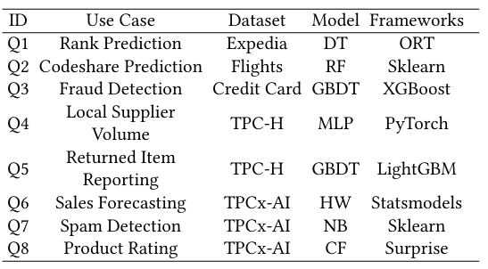

# IMBridge Experiments

Here are the expriments staffs of our Paper *Mitigating the Impedance Mismatch between Prediction Query Execution and Database Engine*.

## Experiments in Our Paper

In this paper, we study the performance of our prototype system IMBridge and make the following experiments on Publicly-available Datasets and Benchmark Datasets (TPCx-AI workload):
* Plain OceanBase with vectorized Python UDF
* Efficiency of One-off Context Setup
    * End to End Performance
    * Overhead of Inference Context Setup
    * Impact of Model Size
* Efficiency of Desirable Batching Inference
    * End to End Performance
    * Overhead of Batch Control
    * Impact of Query Selectivity
* Comparsion with other systems (EvaDB, PostgreSQL DuckDB, and MADlib)
* Performance on large-scale datasets

## Datasets

### Publicly-available Datasets

The folder 'public_datasets' contains four datasets: Expedia, Flights, Hospital and Credit Card.

In each folder, the .csv file represent the original dataset. The train_xxx.py files are model training scripts. The .pkl, .onnx, .txt, etc. files are pre-trained models used in prediction queries.

Also, the model sizes of Random Forest and GBDT models can be tuned in the training scripts.

We scaled these datasets by replicating them in expand_xxx.py script. It is avaliable to control the data size and rows.

### Benchmark Datasets
The folder 'tpch_datasets' contains the models and serving datasets for TPC-H benchmark of scale factor 10. 

The folder 'tpcxai_datasets' contains the use cases (models and serving datasets) generated by TPCx-AI benchmark of scale factor 10. 

Actually, we scaled Q4-Q8 of scale factor 20, 40 60, 80, and 100 in our experiments. However, it is too large to showcase them here. 

Users can scale them by using TPC-H tookkits from https://www.tpc.org/tpch/, TPCx-AI toolkits from www.tpc.org/tpcx-ai/ 

## Queries

The following table shows the models and ML frameworks for the prediction functions.

In the Directory 'Query/IMBridge',  script 'create_udfs.py' contains the CREATE statements of prediction functions we used in our experiments. And script 'conn.py' contains the SELECT statements of those.

For each prediction function defination, users can choose to create holistic or staged-aware prediction function, which represent the on/off of manual One-off Context Setup.

For Q1-Q3 , we use annotations to show the selection rates of different filters in each query.

For Q6-Q8, we add prediction functions as a part of the WHERE clause.

For Q6-Q8, we transform the original TPCx-AI DataFrame serving into SQL SELECT statements.

## Other Systems

We make the comparsion on overall performance with EvaDB, DuckDB, PostgreSQL and MADlib.

For EvaDB, we use plain OceanBase as the backend and set up the inference context before pulling data from the database.

## Additional Imformation

Submodule 'IMBridge' contains the source code of our prototype system based on OceanBase.

Submodule 'PFOptimizer' contains the source code of the runtime inference reuse cache, it's a standalone Python module.